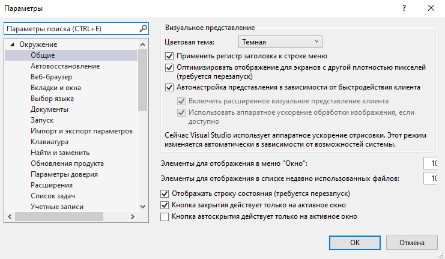

МИНИСТЕРСТВО НАУКИ  И ВЫСШЕГО ОБРАЗОВАНИЯ РОССИЙСКОЙ ФЕДЕРАЦИИ  
Федеральное государственное автономное образовательное учреждение высшего образования  
"КРЫМСКИЙ ФЕДЕРАЛЬНЫЙ УНИВЕРСИТЕТ им. В. И. ВЕРНАДСКОГО"  
ФИЗИКО-ТЕХНИЧЕСКИЙ ИНСТИТУТ  
Кафедра компьютерной инженерии и моделирования
  
### Отчёт по лабораторной работе № 1  по дисциплине "Программирование"
 
​
студента 1 курса группы ИВТ-б-о-191(2)  
 Слюсарева Владислава Викторовича  
 направления подготовки 09.03.01 "Информатика и вычислительная техника" 

  
<table>
<tr><td>Научный руководитель  старший преподаватель кафедры  компьютерной инженерии и моделирования</td>
<td>(оценка)</td>
<td>Чабанов В.В.</td>
</tr>
</table>
  
​
Симферополь, 2019

#### Цель
изучить основные возможности создания и отладки программ в IDE Clion.
#### Ход работы
  
1. **Как создать консольное приложение С++;**
  
    * При создании проекта выбрать "Консольное приложение" (рис. 1). 
   
Рис.1. Консольное приложение
  
2. **Как изменить цветовую схему (оформление) среды;**
  
   * В верхней панели окна перейти в **Средства/Параметры/Окружение/Общие** (рис. 2).
   
Рис.2. Цветовая тема
  
3. **Как закомментировать/раскомментировать блок кода средствами VS;**
  
   * Для комментирования/раскомментирования однострочными комментариями нужно воспользоваться комбинацией `Ctrl + Shift + /`.
   * Для комментирования/раскомментирования многострочными комментариями нужно выделить часть кода и воспользоваться комбинацией `Ctrl + Shift + /`.
  
4. **Как открыть в проводнике папку с проектом средствами VS;**
  
   * В панели над обозревателем решений нажать `Открыть файл`или комбинацию `Ctrl + O` (рис. 3).
 
Рис.3. Показать в файлах
  
5. **Какое расширение файла-проекта используется в VS;**
  
В VS у файла-проекта расширение `.sln`.
  
6. **Как запустить код без отладки (не менее 2 способов);**
  
    * В меню `Отладка` выбрать `Запуск без отладки`;
    * Использовать комбинацию `Ctrl + F5`;
  
7. **Как запустить код в режиме отладки (не менее 2 способов);**
  
    * В меню `Отладка` выбрать `Начать отладку`;
    * Нажать клавишу `F5`;
  
8. **Как установить/убрать точку останова (breakpoint);**
  
   * Нажать слева от номера соответсвующей строки. В результате установится/уберется красная точка останова (рис.4).
 
Рис.4. Breakpoint
  
9. 
    * **Какое значение содержит переменная i в 5й строке?**
        Переменная i содержит значение `{int} -858993460`.
    * **Какое значение содержит переменная i в 6й строке?**
        Переменная i содержит значение `{int} 5`.
         
10. 
    * **Какое значение содержит переменная i в 5й строке?**
        Переменная i содержит значение `{double} -9,2559631349317831e+61,`.
    * **Какое значение содержит переменная i в 6й строке?**
        Переменная i содержит значение `{double} 5`.
  

#### Ввывод
в ходе лабораторной работы были изучены основыне возможности и отладки программ в IDE Clion, как
* Создание консольных приложений;
* Возможность смены цветового оформления среды;
* Возможноть комментирования/раскомментирования кода;
* Возможность открыть требуемый файл в проводнике;
* Возможность открыть созданный ранее проект;
* Возможность запуска кода как с отладкой, так и без нее разными способами;
* Возможность устанавливать точки останова;
* Возможность узнавать значения переменных в ходе выполнения программой команд с точкой останова.
