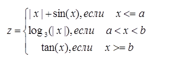
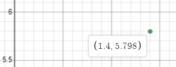
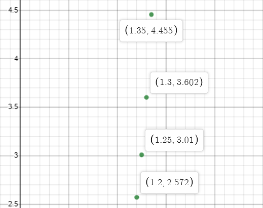
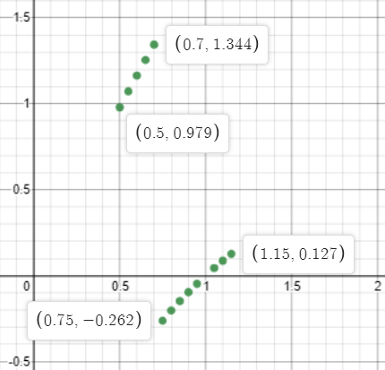
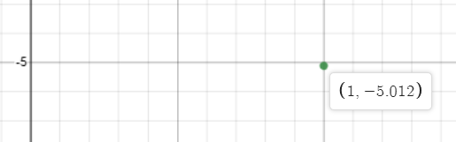

МИНИСТЕРСТВО НАУКИ  И ВЫСШЕГО ОБРАЗОВАНИЯ РОССИЙСКОЙ ФЕДЕРАЦИИ  
Федеральное государственное автономное образовательное учреждение высшего образования  
"КРЫМСКИЙ ФЕДЕРАЛЬНЫЙ УНИВЕРСИТЕТ им. В. И. ВЕРНАДСКОГО"  
ФИЗИКО-ТЕХНИЧЕСКИЙ ИНСТИТУТ  
Кафедра компьютерной инженерии и моделирования
<br/><br/>
### Отчёт по лабораторной работе № 2<br/> по дисциплине "Программирование"
<br/>
​
студента 1 курса группы ИВТ-б-о-191(2)  
<br/>Слюсарева Владислава Викторовича  
<br/>направления подготовки 09.03.01 "Информатика и вычислительная техника" 

<br/><br/>
<table>
<tr><td>Научный руководитель<br/> старший преподаватель кафедры<br/> компьютерной инженерии и моделирования</td>
<td>(оценка)</td>
<td>Чабанов В.В.</td>
</tr>
</table>
<br/><br/>
​
Симферополь, 2019

#### Цель

* Овладеть практическими навыками разработки и программирования вычислительного процесса циклической структуры;
* Сформировать навыков программирования алгоритмов разветвляющейся структуры;
* Изучить операторы ветвления. Особенности использования полной и сокращенной формы оператора `if` и тернарного оператора.

#### Ход работы

Из таблицы была выбрана фукция 
       <br/><br/>
       
       <br/>Рис.1. Формула

1. Протабулируйте функцию и запишите получившиеся реультаты в отчёт в виде таблицы. При этом ***a*** = 0.7, ***b*** = 1.2, начала и конца интервала ***х<sub>нач</sub>*** = 0.5, ***x<sub>кон</sub>*** = 1.5 и шага ***d<sub>x</sub>*** = 0.05;

    | x | y |
    |---|---|
    |  0.5 | 0.979426 |
    |  0.55 | 1.07269 |
    |  0.6 | 1.16464 |
    |  0.65 | 1.25519 |
    |  0.7 | 1.34422 |
    |  0.75 | -0.26186 |
    |  0.8 | -0.203114 |
    |  0.85 | -0.147931 |
    |  0.9 | -0.0959033 |
    |  0.95 | -0.0466892 |
    |  1 | 4.04227e-16 |
    |  1.05 | 0.0444107 |
    |  1.1 | 0.0867551 |
    |  1.15 | 0.127217 |
    |  1.2 | 2.57215 |
    |  1.25 | 3.00957 |
    |  1.3 | 3.6021 |
    |  1.35 | 4.45522 |
    |  1.4 | 5.79788 |
    |  1.45 | 8.23809 |
    |  1.5 | 14.1014 |

2. Определите минимальное и максимальное значение функции на указанном интервале и запешите результаты в отчёт;

    Минимум: -0.26186,  максимум: 14.1014.
    
3. График функции с нанесенными точками, которые получились в процессе табуляции, и точками минимума и максимума (рис. 2-5).

<br/> 
Рис.2. График, часть 1
<br/> 
Рис.3. График, часть 2
<br/> 
Рис.4. График, часть 3
<br/> 
Рис.5. График, часть 4
    
#### Код программы
```cpp
#include <iostream>
#include <cmath>

using namespace std;

bool approximatelyEqualAbsRel(double a, double b, double absEpsilon, double relEpsilon)
{
    // Проверяем числа на их близость - это нужно в случаях, когда сравниваемые числа являются нулевыми или около нуля
    double diff = fabs(a - b);
    if (diff <= absEpsilon)
        return true;

    // В противном случае, возвращаемся к алгоритму Кнута
    return diff <= ((fabs(a) < fabs(b) ? fabs(b) : fabs(a)) * relEpsilon);
}

int main() {

    double a, b, x1, x2, d, z, xma, xmi, x;

    bool flag = true;

    cin >> a >> b >> x1 >> x2 >> d;
    cout << "|  " << 'x' << " | " << 'y' << " |" << endl << "|-----|-----|" << endl;

    x = x1;
    xma = 0;
    xmi = 0;

    for (int i = 0; i <= (x2 - x1) / d; i++, x += d) {

        if (approximatelyEqualAbsRel(x, a, 1e-12, 1e-8)) z = abs(x) + sin(x);
        else if (x < a) z = abs(x) + sin(x);
        else if ((a < x) && (x < b)) z = log(abs(x)) / log(3);
        else if (approximatelyEqualAbsRel(x, b, 1e-12, 1e-8)) z = tan(x);
        else if (x > b) z = tan(x);

        if (flag) {
            xma = z;
            xmi = z;
            flag = false;
        }
        else if (z > xma) xma = z;
        else if (z < xmi) xmi = z;

        cout << "|  " << x << " | " << z << " |" << endl;
    }
    cout << endl << "max: " << xma << "  min: " << xmi << endl;

    return 0;
}
```

#### Ввывод

в ходе лабораторной работы были получены такие навыки, как
* умение применять оператор ветвления и циклы;
* умение разработки и программирования вычислительного процесса циклической структуры;
* умение программирования алгоритмов разветвляющейся структуры.

