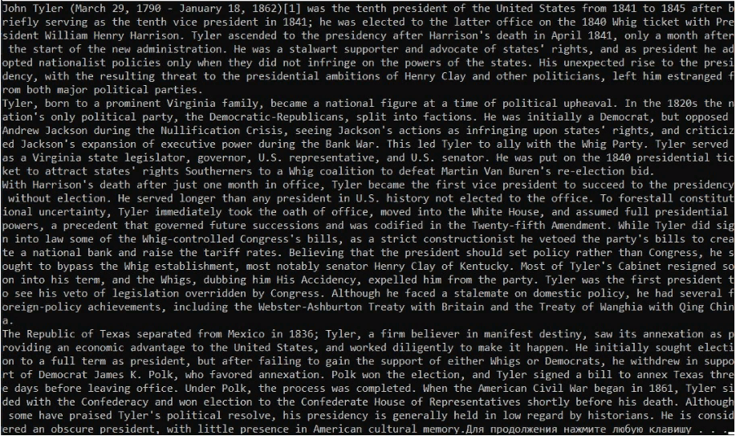

МИНИСТЕРСТВО НАУКИ  И ВЫСШЕГО ОБРАЗОВАНИЯ РОССИЙСКОЙ ФЕДЕРАЦИИ  
Федеральное государственное автономное образовательное учреждение высшего образования  
"КРЫМСКИЙ ФЕДЕРАЛЬНЫЙ УНИВЕРСИТЕТ им. В. И. ВЕРНАДСКОГО"  
ФИЗИКО-ТЕХНИЧЕСКИЙ ИНСТИТУТ  
Кафедра компьютерной инженерии и моделирования
  
### Отчёт по лабораторной работе № 3  по дисциплине "Программирование"
 
​
студента 1 курса группы ИВТ-б-о-191(2)  
 Слюсарева Владислава Викторовича  
 направления подготовки 09.03.01 "Информатика и вычислительная техника" 

  
<table>
<tr><td>Научный руководитель  старший преподаватель кафедры  компьютерной инженерии и моделирования</td>
<td>(оценка)</td>
<td>Чабанов В.В.</td>
</tr>
</table>
  
​
Симферополь, 2019

#### Цель
1. Закрепить навыки разработки программ использующих операторы цикла;
2. Закрепить навыки разработки программ использующих массивы;
3. Освоить методы подключения сторонних библиотек.

#### Ход работы

1. В соответствии с вашим вариантом выберите из таблице 1 ссылку на картинку и ключ. Номер варианта соответствует номеру в журнале академической группы. **Картинка весит около 1 МБ**.

2. Декодируйте сообщение и выведите его в консоль.
   
    
                    
  
    Рис 1. Дешифруемое изображение
  
3. Ключ

   

   

   ​                                  Рис 2. Ключ
>Код дешифровки находится в папке с лабораторной

 Рис. 2 Результат дешифровки

**Вывод**: в ходе лабораторной работы я закрепил навыки разработки программ использующих операторы цикла, закрепил навыки разработки программ использующих массивы, освоил методы подключения сторонних библиотек.
