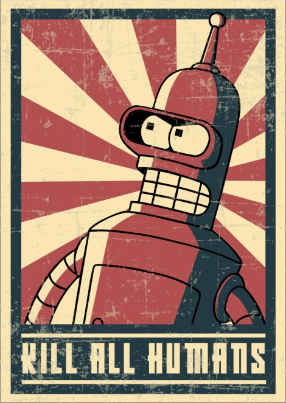
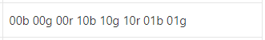
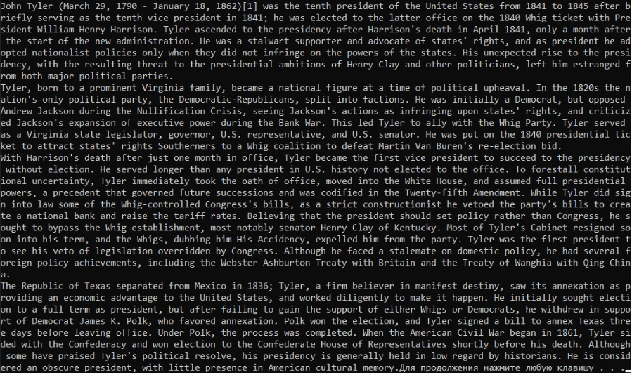

МИНИСТЕРСТВО НАУКИ  И ВЫСШЕГО ОБРАЗОВАНИЯ РОССИЙСКОЙ ФЕДЕРАЦИИ  
Федеральное государственное автономное образовательное учреждение высшего образования  
"КРЫМСКИЙ ФЕДЕРАЛЬНЫЙ УНИВЕРСИТЕТ им. В. И. ВЕРНАДСКОГО"  
ФИЗИКО-ТЕХНИЧЕСКИЙ ИНСТИТУТ  
Кафедра компьютерной инженерии и моделирования
<br/><br/>
### Отчёт по лабораторной работе № 3<br/> по дисциплине "Программирование"
<br/>
​
студента 1 курса группы ИВТ-б-о-191(2)  
<br/>Слюсарева Владислава Викторовича  
<br/>направления подготовки 09.03.01 "Информатика и вычислительная техника" 

<br/><br/>
<table>
<tr><td>Научный руководитель<br/> старший преподаватель кафедры<br/> компьютерной инженерии и моделирования</td>
<td>(оценка)</td>
<td>Чабанов В.В.</td>
</tr>
</table>
<br/><br/>
​
Симферополь, 2019

#### Цель
1. Закрепить навыки разработки программ использующих операторы цикла;
2. Закрепить навыки разработки программ использующих массивы;
3. Освоить методы подключения сторонних библиотек.

#### Ход работы

1. Была выбрана картинка (рис. 1) и ключ (рис. 2) для дешифровки.
   
       
    Рис.1. Дешифруемая картинка
  
    <br/>
    Рис.2. Ключ

2. Код дешифровки:

```C++
#include <iostream>
#include "libbmp.h"
#include <string>
using namespace std;
enum Channel {
	RED,
	GREEN,
	BLUE
};
int binary_to_int(string t) {
	int result = (int)t[0] * 128 + (int)t[1] * 64 +
		(int)t[2] * 32 + (int)t[3] * 16 +
		(int)t[4] * 8 + (int)t[5] * 4 +
		(int)t[6] * 2 + (int)t[7];
	return result;
}
bool check(string* temp) {
	if (temp->size() == 8) {
		if ((char)binary_to_int(*temp) == '\0') return false;
		cout << (char)binary_to_int(*temp);
		*temp = "";
	}
	return true;
}
bool getChar(BmpImg* img, int x, int y, string* temp, Channel channel) {
	switch (channel) {
	case RED:
		*temp += ((int)img->red_at(x, y)) % 2;
		break;
	case GREEN:
		*temp += ((int)img->green_at(x, y)) % 2;
		break;
	case BLUE:
		*temp += ((int)img->blue_at(x, y)) % 2;
		break;
	}
	if (!check(temp)) return false;
	return true;
}
int main() {
	setlocale(LC_ALL, "Russian");
	BmpImg img;
	img.read("pic10.bmp");
	string temp = "";
	for (int i = 0; i < img.get_height(); i++) {
		for (int j = 0; j < img.get_width(); j++) {
			if (!getChar(&img, j, i, &temp, BLUE)) {
				system("pause"); return 3;
			}
			if (!getChar(&img, j, i, &temp, GREEN)) {
				system("pause"); return 3;
			}
			if (!getChar(&img, j, i, &temp, RED)) {
				system("pause"); return 3;
			}
		}
	}
	system("pause");
	return 4;
}
```

3. Результат дешифровки (рис. 3).

   
   Рис.3. Результат дешифровки

**Вывод**: 
в ходе выполнения лабораторной работы я 
* закрепил навыки разработки программ использующих операторы цикла 
* закрепил навыки разработки программ использующих массивы 
* освоил методы подключения сторонних библиотек.
