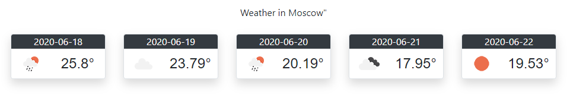

МИНИСТЕРСТВО НАУКИ  И ВЫСШЕГО ОБРАЗОВАНИЯ РОССИЙСКОЙ ФЕДЕРАЦИИ  
Федеральное государственное автономное образовательное учреждение высшего образования  
"КРЫМСКИЙ ФЕДЕРАЛЬНЫЙ УНИВЕРСИТЕТ им. В. И. ВЕРНАДСКОГО"  
ФИЗИКО-ТЕХНИЧЕСКИЙ ИНСТИТУТ  
Кафедра компьютерной инженерии и моделирования
<br/><br/>
### Отчёт по лабораторной работе № 6<br/> по дисциплине "Программирование"
<br/>
​
студента 1 курса группы ИВТ-б-о-191(2)  
<br/>Слюсарева Владислава Викторовича  
<br/>направления подготовки 09.03.01 "Информатика и вычислительная техника" 

<br/><br/>
<table>
<tr><td>Научный руководитель<br/> старший преподаватель кафедры<br/> компьютерной инженерии и моделирования</td>
<td>(оценка)</td>
<td>Чабанов В.В.</td>
</tr>
</table>
<br/><br/>
​
Симферополь, 2020

#### Цель

* Закрепить навыки разработки многофайловыx приложений;
* Изучить способы работы с API web-сервиса;
* Изучить процесс сериализации/десериализации данных.

#### Ход работы

1. **API ключ от openweathermap.org:** 022f7d382526ba03bb93602e96fe8d2a<br/>

2. **Основной код программы:**

```C++

#include <iostream>
#include <fstream>
#include <httplib/httplib.h>
#include <nlohmann/json.hpp>
#include <string>

using json = nlohmann::json;

void replace(std::string& str, const std::string from, std::string  to, int key)
{
    if (key == 1) to = to.substr(1, 10);
    else if(key==2) to = to.substr(1, 3);

    int startPos = str.find(from);
    if (startPos == std::string::npos) return;

    str.replace(startPos, from.length(), to);
}

/* "id": 1510514,
    "name": "Belogorsk",
    "state": "",
    "country": "RU",
    "coord": {
      "lon": 88.489723,
      "lat": 55.01778*/

//виджет
void gen_response(const httplib::Request& req, httplib::Response& result) {  
    std::string widget;
    httplib::Client cli("api.openweathermap.org", 80);
    auto res = cli.Get("/data/2.5/forecast?id=1510514&units=metric&APPID=852f923d23e30df95c2b94d2e5cdbf6b");
    json jsn;
   
    if (res && res->status == 200) jsn = json::parse(res->body);
    std::ifstream stream("informer_template.html");
    if (!stream) { std::cout << "NoOpen"; }
    getline(stream, widget, '\0');
   
    stream.close();


    replace(widget, "{city.name}", jsn["city"]["name"].dump(), 1);
    for (int i = 0; i < 5; i++)
    {

        int start = jsn["list"][0]["dt"];
        for (int i = 0; i < 40; i++) // 5*8=40
        {
            if (jsn["list"][i]["dt"] >= start)
            {
                replace(widget, "{list.dt}", jsn["list"][i]["dt_txt"].dump(), 1);
                replace(widget, "{list.weather.icon}", jsn["list"][i]["weather"][0]["icon"].dump(), 2);
                replace(widget, "{list.main.temp}", jsn["list"][i]["main"]["temp"].dump(), 0);
                start += 86400;
            }
        }
    }
    result.set_content(widget, "text/html");
}


int main()
{
    httplib::Server svr;
    svr.Get("/", gen_response);
    svr.listen("localhost", 3000);
}

```
<br/>

3. **Результат работы программы:** <br/>

    <br/>
    Рис.1. Погода 


**Вывод:** <br/>

В ходе выполнения лабораторной работы были закреплены навыки 
* разработки многофайловыx приложений,
* изучены способы работы с API web-сервиса и процесс сериализации/десериализации данных.
