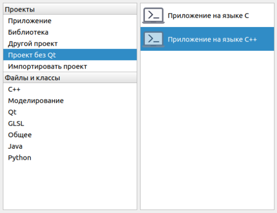
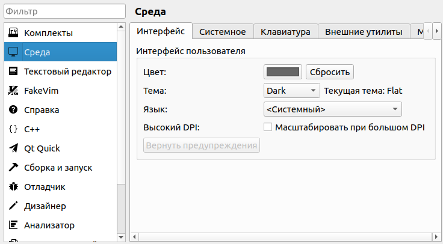

МИНИСТЕРСТВО НАУКИ  И ВЫСШЕГО ОБРАЗОВАНИЯ РОССИЙСКОЙ ФЕДЕРАЦИИ  
Федеральное государственное автономное образовательное учреждение высшего образования  
"КРЫМСКИЙ ФЕДЕРАЛЬНЫЙ УНИВЕРСИТЕТ им. В. И. ВЕРНАДСКОГО"  
ФИЗИКО-ТЕХНИЧЕСКИЙ ИНСТИТУТ  
Кафедра компьютерной инженерии и моделирования
  
### Отчёт по лабораторной работе № 7  по дисциплине "Программирование"
 
​
студента 1 курса группы ИВТ-б-о-191(2)  
 Слюсарева Владислава Викторовича  
 направления подготовки 09.03.01 "Информатика и вычислительная техника" 

  
<table>
<tr><td>Научный руководитель  старший преподаватель кафедры  компьютерной инженерии и моделирования</td>
<td>(оценка)</td>
<td>Чабанов В.В.</td>
</tr>
</table>
  
​
Симферополь, 2020

#### Цель

* Изучить основные возможности создания и отладки программ в IDE Qt Creator.

#### Ход работы

1. **Как создать консольное приложение С++ в IDE Qt Creator без использования компонентов Qt?**

    * Нужно открыть меню `Файл` и выбрать `Создать файл или проект`;
    * В появившемся окне выбираем `Проект без Qt`; 
    
       
    Рис.1. Консольное приложение без Qt

2. **Как изменить цветовую схему (оформление) среды?**

    * Нужно открыть меню **Инструменты/Параметры/Среда/Интерфейс** (рис. 2);
        
       
    Рис.2. Цветовая схема
    
3. **Как закомментировать/раскомментировать блок кода средствами Qt Creator?**
    
    * Для комментирования/раскомментирования нужно воспользоваться комбинацией `Ctrl + /`.

4. **Как открыть в проводнике папку с проектом средствами Qt Creator?**
    
    * Открыть меню проекта и выбрать `Открыть каталог файла`.
   
5. **Какое расширение файла-проекта используется Qt Creator?**
    
    * В Qt Creator расширение файла-проекта `.pro`.
    
6. **Как запустить код без отладки?**

    В левом нижнем углу нажать кнопку `Запустить`
    
7. **Как запустить код в режиме отладки?**

    В левом нижнем углу нажать кнопку `Запуск отладки`
    
8. **Как установить/убрать точку останова (breakpoint)?**

    Нажать слева от номера соответсвующей строки. В результате установится/уберется красная точка останова.

9. * **Какое значение содержит переменная i в 5й строке?**
    
      `i = 858993460`
        
   * **Какое значение содержит переменная d в 6й строке?**
    
      `d = -9.2559631349317831e+61`
        
   * **Какие значение содержатся в переменных i и  d в 7й строке?**
    
      `d = 5`. `i = 5`
        
   * **Совпадают ли эти значения с теми, что вы получали в MSVS для соответствующих типов?**
    
      Не совпадают

10. **Закройте проект и перейдите на вкладку «Начало» => «Примеры»**;
11. **Выберите проект «Calculator Form Example». Для этого можно воспользоваться строкой поиска**;
12. **Изучите (по желанию) описание проекта в открывшемся окне**;
13. **Сейчас вы находитесь на вкладке «Проекты». Выберите комплект сборки**;
14. **Перейдите на вкладку «Редактор» и запустите сборку проекта**;
15. **В инспекторе проекта выберите файл «main.cpp». В этом файле установите курсор на слово «show» в строке calculator.show(); и нажмите F1. Изучите справочную информацию. Таким же образом можно получить справку по любому объекту/методу/полю доступному в Qt**;
16. **В инспекторе проекта выберите файл «Формы» => «calculatorform.ui» и дважды счёлкните ЛКМ**;
17. **Вы попали на вкладку «Дизайн». На форме замените английский текст на русский. Пересоберите проект**. (рис. 3)
    
     
    Рис.3.

#### Ввывод

в ходе выполнения лабораторной работы были получены такие навыки
* создания приложений в среде Qt Creator;
* настраивание внешнего вида среды;
* комментирование строк;
* запуск кода в разных режимах;
* редактирование форм интерфейса.

